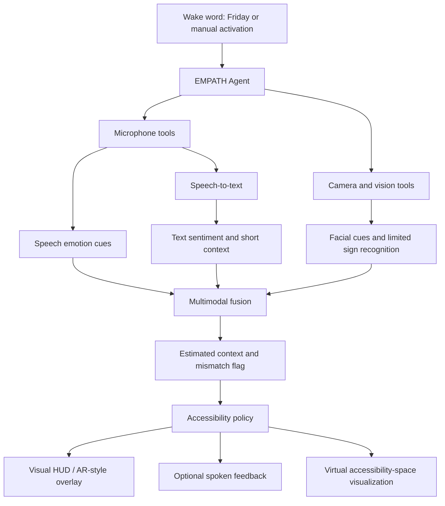

<div align="center">

# EMPATH-EYE

### A Multimodal Agentic AI Accessibility Assistant

**Hear the words. See the cues. Understand the context.**

A laptop-based academic prototype combining speech-to-text, speech-emotion cues, sentiment analysis, computer vision, limited-vocabulary sign recognition, and AR-style visual overlays to support more context-aware communication.


</div>

---

## Overview

Many speech-to-text tools capture **what was said** but may leave out useful conversational cues such as vocal delivery, sentiment, facial-expression cues, and simple visual gestures.

**EMPATH-EYE** explores how these signals can be combined in one accessibility-focused desktop application. A single orchestration agent selects from available tools, combines their outputs into an estimated conversational context, and presents information through a visual HUD and optional spoken feedback.

The project is designed as a student prototype that demonstrates concepts from **Agentic AI, computer vision, audio processing, NLP, accessibility design, and AR/VR** using a standard laptop.

> **Important:** EMPATH-EYE estimates cues; it does not determine a person's true emotions. It is not a clinical product or a production-ready accessibility system.

## Demo preview


*The interface shows the webcam overlay, live transcription, estimated emotional context, EMPATH Agent activity, accessibility-mode controls, and a virtual accessibility space.*

To display this image on GitHub, add the project screenshot to your repository at `docs/assets/empath-eye-dashboard.png`. If you prefer another location, update the image path above.

## Key features

- **Speech-to-text (STT):** near-real-time transcription using a local Vosk model.
- **Speech emotion recognition (SER):** lightweight acoustic estimates of vocal-emotion cues.
- **Sentiment analysis:** lexicon-based positive, negative, or neutral text sentiment.
- **Facial-expression cues:** optional camera-based visual estimates.
- **Limited-vocabulary sign recognition:** prototype recognition for a small predefined set of signs.
- **Multimodal cue fusion:** combines available audio, face, and NLP signals using configurable weights.
- **Mismatch awareness:** can flag cases where text sentiment and vocal cues appear inconsistent.
- **Agentic orchestration:** one EMPATH Agent selects from a constrained set of tools and actions.
- **Wake-word interaction:** listens for **“Friday”**, with Space/button activation as a fallback.
- **Accessibility modes:** DHH, Blind, and Dual presentation modes.
- **AR-style HUD:** overlays contextual information on the webcam view.
- **VR-inspired visualization:** a screen-based virtual accessibility space; a VR headset is not required.
- **Optional spoken feedback:** offline text-to-speech through `pyttsx3`.
- **Privacy-aware defaults:** raw audio/video is not saved by default.

## Accessibility modes

| Mode | Intended presentation |
|---|---|
| **DHH** | Visual-first captions and estimated conversational cues |
| **Blind** | Prioritized spoken summaries rather than narrating every visual event |
| **Dual** | Visual and spoken feedback together |

These modes are prototype interaction choices, not a guarantee of accessibility for every user. Testing with members of the intended communities would be needed to evaluate usability.

## How it works



### Agentic AI design

EMPATH-EYE uses **one orchestrating agent**, rather than describing every model as a separate agent.

The agent follows a constrained workflow:
1. Wait for wake-word or manual activation.
2. Decide which enabled tools are relevant to the current interaction.
3. Request available transcription, audio, vision, or language-analysis outputs.
4. Combine available cues with configurable fusion weights.
5. Choose an accessibility response, such as updating the HUD or providing a spoken summary.
6. Return to standby when the listening session ends.

The agent does **not** have unrestricted operating-system control. Its behavior is bounded by the actions implemented in the project.

### Multimodal fusion

The current configuration assigns these starting weights:

| Signal | Weight |
|---|---:|
| Audio emotion cues | 0.40 |
| Facial cues | 0.35 |
| NLP sentiment | 0.25 |

These weights are configurable, not scientifically validated measures of emotional importance. Signals may be unavailable or unreliable because of microphone quality, lighting, language, background noise, or other conditions. Treat the output as an estimate—not a fact about the speaker.

## Technology stack

| Component | Technology | Purpose |
|---|---|---|
| Language | Python | Application logic and orchestration |
| Desktop UI | PySide6 | Dashboard and interactive controls |
| Camera and overlays | OpenCV | Webcam processing and AR-style HUD |
| Optional vision utilities | MediaPipe | Face/hand-related visual processing |
| Speech recognition | Vosk | Local speech-to-text and wake-word support |
| Audio analysis | NumPy, librosa, sounddevice, soundfile | Audio capture and acoustic features |
| Sentiment | Lightweight lexicon-based NLP | Text sentiment estimate |
| Text-to-speech | pyttsx3 | Offline spoken feedback |
| Testing | pytest | Unit and project tests |

## Requirements

- Windows is the documented setup environment.
- Python **3.10 or newer** is recommended.
- A laptop webcam, microphone, speakers/headphones, and display.
- Internet access for initial dependency installation and model download; core processing is designed to run locally after required assets are installed.
- Enough memory and CPU capacity to run the selected libraries and models.

No AR glasses, VR headset, Arduino, or additional sensors are required for the current prototype.

## Installation (Windows PowerShell)

### 1. Clone the repository

Replace `YOUR-USERNAME` with your GitHub username.

```powershell
git clone https://github.com/YOUR-USERNAME/EMPATH-EYE.git
cd EMPATH-EYE
```

### 2. Create and activate a virtual environment

```powershell
python -m venv .venv
.\.venv\Scripts\Activate.ps1
python -m pip install --upgrade pip
```

If PowerShell blocks environment activation, you can use Command Prompt to activate the environment, or review your local PowerShell execution-policy settings.

### 3. Install dependencies

```powershell
python -m pip install -r requirements.txt
```

### 4. Download the speech model

Run the model-download script if it is present in your checkout:

```powershell
python scripts\download_models.py
```

The configured Vosk model directory is `models/vosk-model-small-en-us-0.15`. Model files may be excluded from Git because of their size; download them locally before testing speech recognition.

If the model is unavailable, the application may still launch, but speech recognition and wake-word functionality may be limited. Use the manual activation control where available.

### 5. Launch EMPATH-EYE

```powershell
python app.py
```

Allow camera and microphone access if Windows asks.

## Using the application

1. Launch the application and check the system status.
2. Select **DHH**, **Blind**, or **Dual** mode.
3. Enable or disable the available feature toggles to suit your demo.
4. Say **“Friday”**, or use the Space/Activate fallback shown by the UI.
5. Speak a short sentence and observe the transcript and estimated cues.
6. Compare the visual HUD with the emotional-context and agent-activity panels.
7. Use **Run demo scenes** if available to demonstrate predefined scenarios without relying entirely on live conditions.

The exact behavior depends on the installed models, enabled features, camera/microphone availability, and the implementation in the checked-out version.

## Prototype sign vocabulary

The documented demo vocabulary is:

`HELLO`, `THANK_YOU`, `YES`, `NO`, `HELP`, `STOP`, `OKAY`, `PLEASE`, `I`, `YOU`

This is a **limited-vocabulary prototype**, not a universal sign-language translator. Sign languages have their own grammar and regional variations; the listed labels do not provide full sign-language understanding.

## Repository structure

The project is organized by responsibility. The following is the intended high-level layout; keep it aligned with the files present in your repository.

```text
EMPATH-EYE/
├── app.py
├── config.py
├── requirements.txt
├── agent/             # Agent orchestration and tool selection
├── audio/             # Audio capture and speech processing
├── nlp/               # Sentiment and conversation context
├── vision/            # Camera, face, and sign-related utilities
├── fusion/            # Multimodal cue fusion
├── accessibility/     # Mode-specific response policies
├── tts/               # Spoken feedback
├── ui/                # PySide6 desktop interface
├── ar/                # AR-style overlay components
├── vr/                # Screen-based virtual-space visualization
├── models/            # Locally downloaded model assets
├── data/              # Runtime data; raw media excluded by default
├── tests/              # Automated tests
├── docs/
│   ├── ARCHITECTURE.md
│   ├── EVALUATION.md
│   ├── LIMITATIONS.md
│   └── assets/
│       └── empath-eye-dashboard.png
├── .gitignore
└── README.md
```

Some folders or documentation files may differ between versions. Refer to the actual repository contents as the source of truth.

## Run tests

If the `tests/` directory is present, install pytest and run:

```powershell
python -m pip install pytest
python -m pytest tests -q
```

Record the actual test results in your project report; do not describe tests as passing unless you have run them.

## Privacy and responsible use

- Raw audio/video storage is disabled by default in the current configuration.
- Media buffers are intended to remain in memory during normal use.
- Emotion and sentiment outputs are uncertain estimates and may be wrong.
- Facial analysis can be affected by lighting, camera position, occlusion, and individual differences.
- Speech recognition can fail with accents, background noise, overlapping speakers, or unsupported languages.
- The prototype's limited sign vocabulary must not be relied on for important communication.
- Do not use the application as a substitute for a qualified interpreter, emergency service, clinical assessment, or professional accessibility solution.
- If cloud processing is added in the future, clearly disclose what data leaves the device and obtain appropriate consent.

## Scope and limitations

**What this project demonstrates**
- A constrained, tool-using Agentic AI workflow.
- Integration of audio, text, and visual cues.
- Transparent, configurable multimodal fusion.
- Accessibility-oriented presentation choices.
- A laptop-based AR-style HUD and a headset-optional VR-inspired screen visualization.

**What it does not claim**
- To know a person's real emotional state.
- To provide clinically validated emotion recognition.
- To translate every sign language or sign every sentence.
- To deliver optical see-through AR or immersive headset VR.
- To replace human interpreters or established assistive technologies.
- To be a production-ready or formally validated accessibility device.

## Academic relevance

EMPATH-EYE brings together topics from:

- **Agentic AI:** tool selection, constrained decision policies, state transitions, and short-term context.
- **AR/VR:** real-time overlays and a virtual-space visualization prototype.
- **Computer vision:** webcam input, facial cues, and limited sign recognition.
- **Natural Language Processing:** transcription context and sentiment estimation.
- **Audio AI:** speech recognition and acoustic emotion cues.
- **Human-computer interaction:** mode-dependent information presentation and feedback.
- **Responsible AI:** uncertainty, privacy defaults, scope limits, and transparent claims.

## Future improvements

- Evaluate transcription quality and latency in different acoustic environments.
- Collect consent-based feedback from Deaf and Hard-of-Hearing users and accessibility specialists.
- Evaluate each modality independently before tuning fusion weights.
- Improve robustness to lighting, noise, overlapping speakers, and varied signing conditions.
- Add clear confidence and unavailable-signal states throughout the UI.
- Expand language support and carefully scoped sign-recognition datasets.
- Explore headset-based AR/VR integration as a separate future milestone.
- Document usability, latency, error rates, and privacy testing.

## Contributing

Contributions and constructive feedback are welcome. For changes involving accessibility behavior, emotion estimates, sign recognition, or media handling, please document assumptions, limitations, and test results.

1. Fork the repository.
2. Create a feature branch.
3. Make a focused change.
4. Run relevant tests.
5. Open a pull request describing the change and its limitations.

## License

No license has been specified in the provided project files. Add a `LICENSE` file before presenting the repository as open source, and choose a license appropriate for your project.

---

<div align="center">

**EMPATH-EYE — multimodal cues for more context-aware accessibility.**

Built as an academic prototype exploring Agentic AI, computer vision, NLP, and AR/VR concepts.

</div>
